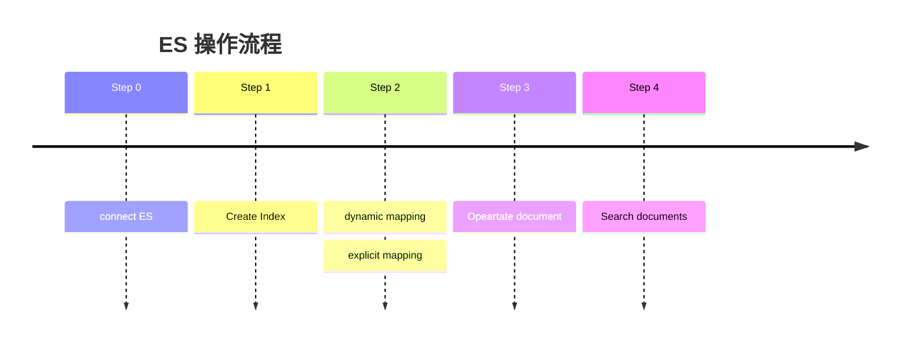

### 1.简介

> Elasticsearch 是一个开源的分布式搜索和分析引擎，专为速度、扩展和 AI 应用而打造。作为一个检索平台，它可以实时存储结构化、非结构化和向量数据，提供快速的混合和向量搜索，支持可观测性与安全分析，并以高性能、高准确性和高相关性实现 AI 驱动的应用。一个开源的分布式搜索引擎，可以用来实现搜索、日志统计、分析、系统监控等功能。

> 在AI环境下，ES和向量数据库的学习必不可少。目标，掌握ES的基本概念和使用技巧。

[Elasticsearch 官网](https://www.elastic.co/docs)

:::note[注意！]

Kibana 使用 edge 打开，有概率`Dev Tools`无法正常使用，请使用 Chrome 打开。

:::

### 2. 安装

> 以docker 安装为例，较为方便。
>
> `curl -fsSL https://elastic.co/start-local | sh`

:::fold[docker-compose.yml 配置]

```yml
services:
  elasticsearch:
    image: docker.elastic.co/elasticsearch/elasticsearch:${ES_LOCAL_VERSION}
    container_name: ${ES_LOCAL_CONTAINER_NAME}
    volumes:
      - dev-elasticsearch:/usr/share/elasticsearch/data
    ports:
      - 127.0.0.1:${ES_LOCAL_PORT}:9200
    environment:
      - discovery.type=single-node
      - ELASTIC_PASSWORD=${ES_LOCAL_PASSWORD}
# xpack.security.enabled 需要相应的license
      - xpack.security.enabled=true
      - xpack.security.http.ssl.enabled=false
      - xpack.license.self_generated.type=trial
      - xpack.ml.use_auto_machine_memory_percent=true
      - ES_JAVA_OPTS=-Xms${ES_LOCAL_HEAP_INIT} -Xmx${ES_LOCAL_HEAP_MAX}
      - cluster.routing.allocation.disk.watermark.low=${ES_LOCAL_DISK_SPACE_REQUIRED}
      - cluster.routing.allocation.disk.watermark.high=${ES_LOCAL_DISK_SPACE_REQUIRED}
      - cluster.routing.allocation.disk.watermark.flood_stage=${ES_LOCAL_DISK_SPACE_REQUIRED}
    ulimits:
      memlock:
        soft: -1
        hard: -1
    healthcheck:
      test:
        [
          "CMD-SHELL",
          "curl --output /dev/null --silent --head --fail -u elastic:${ES_LOCAL_PASSWORD} http://elasticsearch:9200",
        ]
      interval: 10s
      timeout: 10s
      retries: 30

  kibana_settings:
    depends_on:
      elasticsearch:
        condition: service_healthy
    image: docker.elastic.co/elasticsearch/elasticsearch:${ES_LOCAL_VERSION}
    container_name: ${KIBANA_LOCAL_SETTINGS_CONTAINER_NAME}
    restart: 'no'
    command: >
      bash -c '
        echo "Setup the kibana_system password";
        start_time=$$(date +%s);
        timeout=60;
        until curl -s -u "elastic:${ES_LOCAL_PASSWORD}" -X POST http://elasticsearch:9200/_security/user/kibana_system/_password -d "{\"password\":\"${KIBANA_LOCAL_PASSWORD}\"}" -H "Content-Type: application/json" | grep -q "^{}"; do
          if [ $$(($$(date +%s) - $$start_time)) -ge $$timeout ]; then
            echo "Error: Elasticsearch timeout";
            exit 1;
          fi;
          sleep 2;
        done;
      '

  kibana:
    depends_on:
      kibana_settings:
        condition: service_completed_successfully
    image: docker.elastic.co/kibana/kibana:${ES_LOCAL_VERSION}
    container_name: ${KIBANA_LOCAL_CONTAINER_NAME}
    volumes:
      - dev-kibana:/usr/share/kibana/data
      - ./config/telemetry.yml:/usr/share/kibana/config/telemetry.yml
      - ./config/kibana.yml:/usr/share/kibana/config/kibana.yml
    ports:
      - 127.0.0.1:${KIBANA_LOCAL_PORT}:5601
    environment:
      - SERVER_NAME=kibana
      - ELASTICSEARCH_HOSTS=http://elasticsearch:9200
      - ELASTICSEARCH_USERNAME=kibana_system
      - ELASTICSEARCH_PASSWORD=${KIBANA_LOCAL_PASSWORD}
      - XPACK_ENCRYPTEDSAVEDOBJECTS_ENCRYPTIONKEY=${KIBANA_ENCRYPTION_KEY}
      - ELASTICSEARCH_PUBLICBASEURL=http://localhost:${ES_LOCAL_PORT}
    healthcheck:
      test:
        [
          "CMD-SHELL",
          "curl -s -I http://kibana:5601 | grep -q 'HTTP/1.1 302 Found'",
        ]
      interval: 10s
      timeout: 10s
      retries: 30

volumes:
  dev-elasticsearch:
  dev-kibana:
```

:::

### 3. 基本概念

> ES 是基于文档（**Document**）存储，倒排索引进行搜索的。
>
> 倒排索引基本概念：
>
> * 文档（`Document`）：用来搜索的数据，其中的每一条数据就是一个文档。例如一个网页、一个商品信息
> * 词条（`Term`）：对文档数据或用户搜索数据，利用某种算法分词，得到的具备含义的词语就是词条。例如：我是中国人，就可以分为：我、是、中国人、中国、国人这样的几个词条


[近乎实时的搜索](https://www.elastic.co/docs/manage-data/data-store/near-real-time-search)

#### 3.1 索引（Index）

> ES中的索引是相同文档（**Document**）的数据集合，例如用户信息的文档集合称为用户索引。

[Index](https://www.elastic.co/docs/manage-data/data-store/index-basics)

#### 3.2 映射(**Mapping**)

> 对ES索引(**Index**)的结构性约束，类似于数据库的表结构。倒排索引结构虽然不复杂，但是一旦数据结构改变（比如改变了分词器），就需要重新创建倒排索引，这简直是灾难。因此索引库一旦创建，无法修改mapping。但是允许增加新的字段。

[Mapping](https://www.elastic.co/docs/manage-data/data-store/mapping)

#### 3.3文档(**Document**)

> JSON格式的文本信息，ES的存储单元。

#### 3.4 分词器(**analyzer**)

> 分词器控制倒排索引的生成规则。

### 4.操作流程



### 5.  完整示例

参考链接：

- [快速入门](https://www.elastic.co/docs/solutions/search/get-started/index-basics#getting-started-requirements)
- [ElasticSearch (ES从入门到精通一篇就够了)](https://www.cnblogs.com/buchizicai/p/17093719.html)

### 6. 相关性算分详解(影响ES输出排序)

> elasticsearch会根据词条和文档的相关度做打分，从而排序，算法有两种：
>
> * TF-IDF算法(缺陷：词条频率越高，文档得分也会越高，单个词条对文档影响较大)
> * BM25算法，elasticsearch5.1版本后采用的算法

:::fold[例如搜索：虹桥如家 ]

```json
[
  {
    "_score" : 17.850193,
    "_source" : {
      "name" : "虹桥如家酒店真不错",
    }
  },
  {
    "_score" : 12.259849,
    "_source" : {
      "name" : "外滩如家酒店真不错",
    }
  },
  {
    "_score" : 11.91091,
    "_source" : {
      "name" : "迪士尼如家酒店真不错",
    }
  }
]

```

:::

相似性算法 `BM25`

[https://www.elastic.co/blog/practical-bm25-part-2-the-bm25-algorithm-and-its-variables](https://www.elastic.co/blog/practical-bm25-part-2-the-bm25-algorithm-and-its-variables)


q<sub>i</sub>:

> eg: "shane" 、"<font style="color:rgba(54, 65, 52, 1);">shane connelly</font>"
>
> q<sub>0  </sub>："shane"
>
> q<sub>0</sub>、q<sub>1 </sub>："shane" 、“<font style="color:rgba(52, 65, 54, 1);">connelly</font>"

IDF(q<sub>i</sub>)**<font style="color:rgb(52, 55, 65);">:</font>**


> doccount： 文档总数
>
> f（q<sub>i</sub>）： 搜索的term所占据的文档数，例如，总共4篇文档，"shane"存在每一篇文档中，即f（q<sub>i</sub>）=4

`b`:

> 文档长度影响率，默认0.75，0的话文档的长度将不影响相关性

f(q<sub>i</sub>,D)**<font style="color:rgb(52, 55, 65);">:</font>**

> 搜索的term在特定文档中出现的次数，例如doc1中文档内容为"shane"，则为1，doc2中文档内容为"shane shane"，则为2；即出现频率越高值越大

k1<font style="color:rgb(52, 55, 65);">:</font>

> 默认值1.2；K1控制着得分曲线的变化率，越大，曲线变化越陡峭

### 7. API调用

> 查看[上述链接](#5--完整示例)的API调用规则，这里不再复述，**注意:** 上述文档是基于老版本的，需要注意client和具体API操作方法存在些许改变，但大致流程保持一致。或者浏览官方网站或Spring Data了解对应版本API调用规则。

- [Spring Data Elasticsearch ](https://github.com/spring-projects/spring-data-examples/blob/main/elasticsearch/example/src/main/java/example/springdata/elasticsearch/conference/ApplicationConfiguration.java)
- [ES 官方API详情](https://www.elastic.co/docs/api/doc/elasticsearch/)

### 8. 常见问题和优化项

[慢日志](https://www.elastic.co/docs/reference/elasticsearch/index-settings/slow-log)

[分页问题](https://www.elastic.co/docs/reference/elasticsearch/rest-apis/paginate-search-results)

[**security\_exception**](https://discuss.elastic.co/t/security-exception-current-license-is-non-compliant-for-security-with-license-expired-feature-security/97351)
