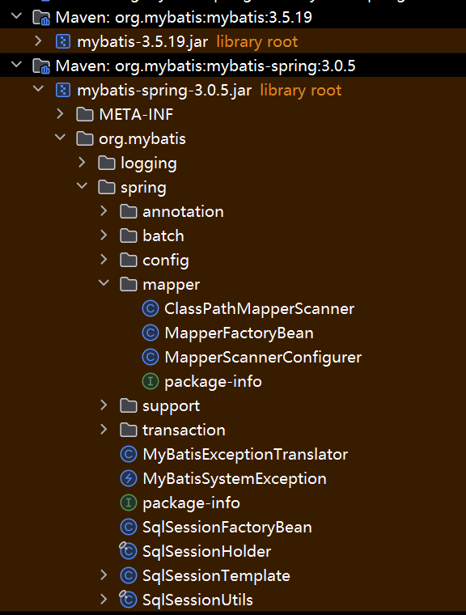
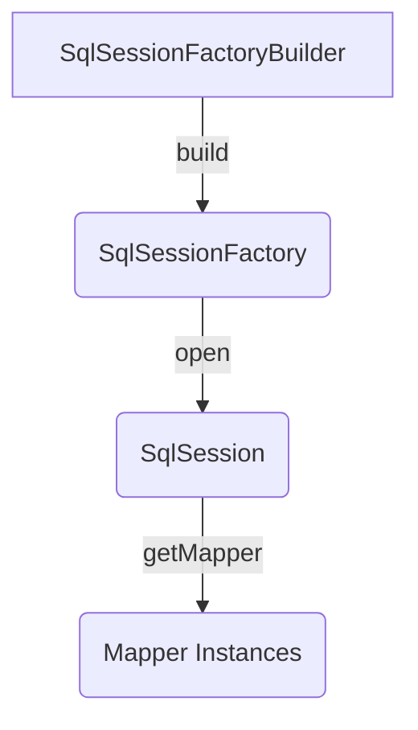
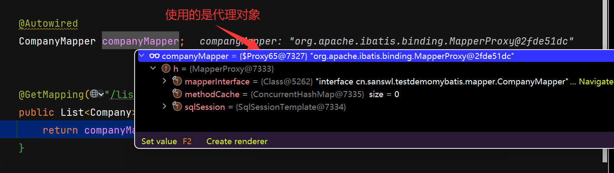
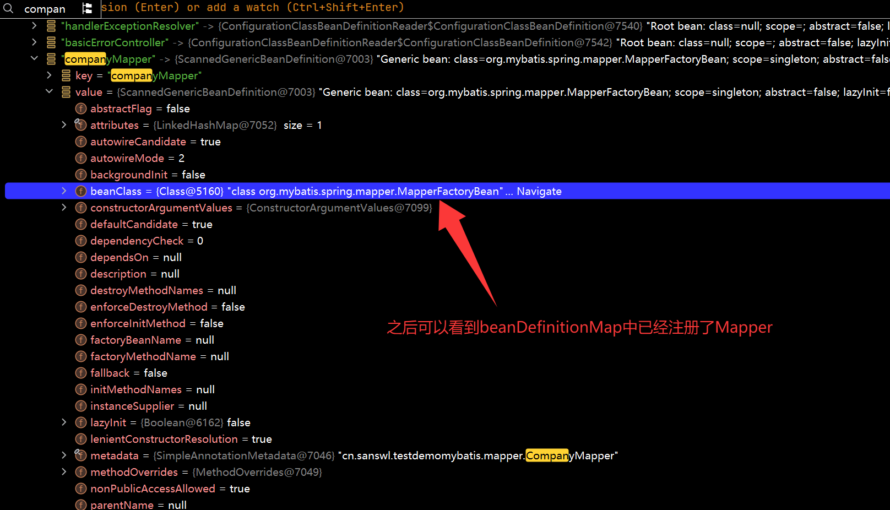

### 1. 了解Mybatis

> Mybatis是Java 的一种常用的ORM框架，允许用户可以通过代码的对象和数据库进行映射。
>
> Mybatis-Plus(以下简称MP)，是对Mybatis的增强包，可以与Mybatis不冲突的使用，学习成本较低（1h左右基本掌握使用）；

以下均为ORM框架，且部分允许Java/kotlin进行混用编写。你可以进入官网查看各自框架的性能和了解他们各自的学习成本。

* [Jimmer](https://github.com/babyfish-ct/jimmer)
* [spring-data-jdbc](https://spring.io/projects/spring-data-jdbc)
* [spring-data-jpa](https://spring.io/projects/spring-data-jpa)
* [easy-query](https://github.com/dromara/easy-query)
* [mybatis](https://mybatis.org/mybatis-3/)
* ......

### 2. 走近源码



1. 生命周期

> 无论什么框架或者应用，照着他的生命周期看下去，基本上可以弄懂个7788了。



2. 关键函数/类

* `DataSource` : 用于创建连接信息
* `SqlSessionFactory` ： 连接工厂，即JDBC，需要指定数据源和Mapper映射文件
* `SqlSessionTemplate` ： sql的会话模板，是线程安全的，可由多个DAO共享
* `DataSourceTransactionManager`：事务管理器，spring容器@Transactional注解的底层实现，例如Neo4jTransactionManager only supports 'required' or 'requires new' propagation，neo4j传播机制只支持required或requires new，当你使用多数据库比如PGSQL、Neo4j时，需要注意管理事务管理器。
* `MapperScan` ： 映射器扫描、注册，扫描指定包下的所有Mapper接口，并注册到spring容器中

### 3. 一步一步的debug

* springboot中Mybatis的 sql 执行流程

> 调用Mapper层，执行sql语句，Mapper层调用sqlsession执行注解书写的SQL语句或xml指定的SQL语句

* 从下图可以看到，mybatis SQL语句执行的对象是代理对象，有着缓存和sqlsession（执行SQL）属性



* 代理对象的获取，很显然mybatis执行sql使用的是代理对象，从`@MapperScan`注解断点容易找到以下信息：

```java
//相关扫描类
public class MapperScannerConfigurer implements BeanDefinitionRegistryPostProcessor, InitializingBean, ApplicationContextAware, BeanNameAware {}

@Override
  public void postProcessBeanDefinitionRegistry(BeanDefinitionRegistry registry) {
    if (this.processPropertyPlaceHolders) {
      processPropertyPlaceHolders();
    }
    //扫描mapper接口，根据mapperscan的basepackage，扫描指定包下的所有Mapper接口，并注册到spring容器中
    ClassPathMapperScanner scanner = new ClassPathMapperScanner(registry);
    scanner.setAddToConfig(this.addToConfig);
    scanner.setAnnotationClass(this.annotationClass);
    scanner.setMarkerInterface(this.markerInterface);
    scanner.setSqlSessionFactory(this.sqlSessionFactory);
    scanner.setSqlSessionTemplate(this.sqlSessionTemplate);
    scanner.setSqlSessionFactoryBeanName(this.sqlSessionFactoryBeanName);
    scanner.setSqlSessionTemplateBeanName(this.sqlSessionTemplateBeanName);
    scanner.setResourceLoader(this.applicationContext);
    scanner.setBeanNameGenerator(this.nameGenerator);
    scanner.setMapperFactoryBeanClass(this.mapperFactoryBeanClass);
    if (StringUtils.hasText(lazyInitialization)) {
      scanner.setLazyInitialization(Boolean.valueOf(lazyInitialization));
    }
    if (StringUtils.hasText(defaultScope)) {
      scanner.setDefaultScope(defaultScope);
    }
    scanner.registerFilters();
    scanner.scan(
        StringUtils.tokenizeToStringArray(this.basePackage, ConfigurableApplicationContext.CONFIG_LOCATION_DELIMITERS));
  }

public class ClassPathMapperScanner extends ClassPathBeanDefinitionScanner {
    doscan(); //扫描到对应的包下的Mapper，并注册到Spring容器中
}
    //内容太长，只截取了入口函数作为记录
  private void processBeanDefinitions(Set<BeanDefinitionHolder> beanDefinitions) {
        BeanDefinitionRegistry registry = this.getRegistry();
        Iterator var4 = beanDefinitions.iterator();

        while(var4.hasNext()) {
            BeanDefinitionHolder holder = (BeanDefinitionHolder)var4.next();
            AbstractBeanDefinition definition = (AbstractBeanDefinition)holder.getBeanDefinition();
            boolean scopedProxy = false;
            if (ScopedProxyFactoryBean.class.getName().equals(definition.getBeanClassName())) {
                definition = (AbstractBeanDefinition)Optional.ofNullable(((RootBeanDefinition)definition).getDecoratedDefinition()).map(BeanDefinitionHolder::getBeanDefinition).orElseThrow(() -> {
                    return new IllegalStateException("The target bean definition of scoped proxy bean not found. Root bean definition[" + holder + "]");
                });
                scopedProxy = true;
            }
            definition.setBeanClass(this.mapperFactoryBeanClass); //询问AI可以了解到这是完成代理关键步骤，允许Spring后续使用工厂实现代理
            definition.getPropertyValues().add("addToConfig", this.addToConfig);
    }
    }

     // Mapper代理获取
     public <T> T getMapper(Class<T> type, SqlSession sqlSession) {
        MapperProxyFactory<T> mapperProxyFactory = (MapperProxyFactory)this.knownMappers.get(type);
        if (mapperProxyFactory == null) {
            throw new BindingException("Type " + type + " is not known to the MapperRegistry.");
        } else {
            try {
                return mapperProxyFactory.newInstance(sqlSession);
            } catch (Exception var5) {
                Exception e = var5;
                throw new BindingException("Error getting mapper instance. Cause: " + e, e);
            }
        }
    }
```



* 调用Mapper层，执行sql语句

```java
//org.apache.ibatis.binding.MapperProxy
 public Object invoke(Object proxy, Method method, Object[] args) throws Throwable {
        try {
            return Object.class.equals(method.getDeclaringClass()) ? method.invoke(this, args) : this.cachedInvoker(method).invoke(proxy, method, args, this.sqlSession);
        } catch (Throwable var5) {
            Throwable t = var5;
            throw ExceptionUtil.unwrapThrowable(t);
        }
    }

 private static class PlainMethodInvoker implements MapperMethodInvoker {
        private final MapperMethod mapperMethod;

        public PlainMethodInvoker(MapperMethod mapperMethod) {
            this.mapperMethod = mapperMethod;
        }

        public Object invoke(Object proxy, Method method, Object[] args, SqlSession sqlSession) throws Throwable {
            return this.mapperMethod.execute(sqlSession, args);
        }
    }
```

### 4. 流程总结

1. 注册配置文件，datasource，TransactionManager等信息
2. 扫描指定的basePackages下的所有Mapper 实例，并注册代理到spring容器中
3. 调用代理的MapperProxy对象， invoke 执行调用
