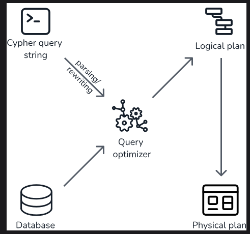

### 1. Neo4j 介绍
>
> 
官网文档：https://neo4j.com/docs/getting-started/ 

### 2. 数据库实例创建
 * 1 : ***创建免费的云库***
> Neo4j AuraDB: Fully Managed Graph Database ：https://neo4j.com/product/auradb/              
 * 2 : ***本地 docker 安装***
> `docker pull neo4j:ubi9` 官方镜像：https://hub.docker.com/_/neo4j 

### 2.1 配置文件
> **配置文件目录：** 

**eg:**
```txt
#server.memory.pagecache.size=10g  页缓存
#dbms.memory.transaction.total.max=256m 事务内存
#db.memory.transaction.max=16m
#server.default_listen_address=0.0.0.0  网络监听，修改库时拒绝外网接入
#dbms.security.auth_enabled=false  是否启用验证（忘记密码时使用）
.......
```
### 2.2 Neo4j使用
1. **数据存储格式介绍**
> Neo4j 存储数据以`节点（Nodes）、标签（Labels）、关系（Relationships）、属性（Properties）`四个部分组成；
>通常标签使用单数的名词(**Person**)表示，首字母大写，关系使用动词表示(**MARRIED_TO**)，全大写;
>`节点允许多个标签，关系只有一个类型`
>
>*匹配节点，关系标签为`DIRECTED`的结果集，方向为 start -(directed) > end，p变量用来存储完整路径*
> **图中的圆代表节点（Nodes），箭头代表关系（Relationships），圆内的单词（Person、Movie）代表节点的标签，红框内显示的为属性（properties），最上面显示的为Neo4j的Cypher语句，后续详细介绍**

2. **数据可视化**
> http://localhost:7474/browser/preview/ (本地)
> https://console-preview.neo4j.io/tools/explore (Aura)
> **安装完毕后，neo4j自带一份浏览器操作页面**
>
### 3. **Cypher操作** 
> http://neo4j.com.cn/public/cypher/default.html (中文版)
> https://neo4j.com/docs/getting-started/cypher/
> https://neo4j.ac.cn/docs/cypher-manual/current/appendix/gql-conformance/ GQL标准
> https://kindatechnical.com/cypher/index.html (cypher例子解释比较全面)

###### 3.1 **增:**
```Cypher
// 单节点
CREATE (
   <node-name>:<label-name1>:<label-name2>
   { 	
      <Property1-name>:<Property1-Value>
      ........
      <Propertyn-name>:<Propertyn-Value>
   }
)
// 带关系
CREATE (<node1-name>:<label1-name>)-
	[<relationship-name>:<relationship-label-name>]
	->(<node2-name>:<label2-name>)

CREATE (dept:Dept { deptno:10,dname:"Accounting",location:"Hyderabad" })
dept:节点名
Dept:标签名
{ deptno:10,dname:"Accounting",location:"Hyderabad" }: 节点属性
CREATE (p1:Profile1)-[r1:LIKES]->(p2:Profile2)
p1、p2:节点
r1:关系
```
###### 3.2 **查:**
```Cypher
MATCH 
(
   <node-name>:<label-name>
)
###注意：Cypher查询组合是将前一个子句的结果表和图的状态作为输入传递给下一个子句，若输入结果集为空直接结束查询；
解决方法：使用 OPTIONAL MATCH替换 MATCH 子句

//子句组合，下面语句类似SQL：select xx from table where xxx
MATCH (bornInEighties:Person)
WHERE bornInEighties.born >= 1980 AND bornInEighties.born < 1990
RETURN bornInEighties.name as name, bornInEighties.born as born
ORDER BY born DESC
//查询符合关系的图
MATCH (m:Movie {title: 'The Matrix'})<-[d:DIRECTED]-(p:Person)
RETURN p.name as director

MATCH (tom:Person {name:'Tom Hanks'})-[r]->(m:Movie)
RETURN type(r) AS type, m.title AS movie
d,r: 变量，存储的是关系结构
m,p,tom: 变量，存储的是节点

//可变路径，下面两种写法意义相同（版本不同），限制搜索的路径长度，至少一个关系，最多3条关系
MATCH p=(:Person)-[:ACTED_IN]-{1,3}() RETURN p LIMIT 25;
MATCH p=(:Person)-[:ACTED_IN*1..3]-() RETURN p LIMIT 25;（不符合GQL标准）
//结果集：
(:Person)-[:ACTED_IN]->(:Movie)
(:Person)-[:ACTED_IN]->(:Movie)<-[:ACTED_IN]-(:Person)
(:Person)-[:ACTED_IN]->(:Movie)<-[:ACTED_IN]-(:Person)-[:ACTED_IN]->(:Movie)

// 查找两节点最短路径，SHORTEST 关键字是在 Neo4j 5.21 中引入的，它在功能上替代并扩展了 shortestPath() 和 allShortestPaths() 函数
MATCH p = ALL SHORTEST (:Person {name:"Keanu Reeves"})--+(:Person {name:"Tom Cruise"})
RETURN count(p) AS pathCount, length(p) AS pathLength

//正则，and组合多条件，eg：or、not、xor
MATCH (p:Person)
WHERE p.name =~ '^A.*' AND p.age>30
RETURN p

//子查询，对每个p节点做匹配，查询friend关系节点数
MATCH (p:Person)
CALL {
    WITH p
    MATCH (p)-[:FRIEND]->(friend)
    RETURN count(friend) AS friendCount
}
WHERE friendCount > 2
RETURN p

//组合查询，UNION、UNION DISTINCT 去重
MATCH (n:Actor)
RETURN n.name AS name
UNION ALL
MATCH (n:Movie)
RETURN n.title AS name

//跳过n行，可做分页
MATCH (n:Person)
RETURN n.name
SKIP {n}
LIMIT 10

```
###### 3.3 **改:**
```Cypher
//更新属性、删除属性
MATCH (
<node-name>:<lable-name>
)
WHERE <condition>
SET <property-name>=<Val>,<property1-name>=<Val1>... / REMOVE <property-name>
//条件更新
MATCH (
<node-name>:<lable-name>
)
SET <property-name>= CASE WHEN <condition> THEN <Val1> ELSE <Val2> END

//更新时间为2020
MATCH (a:Person)-[r:FRIENDS_WITH]->(b:Person)
WHERE a.name = 'Alice' AND b.name = 'Bob'
SET r.since = 2020
RETURN r
r:关系
since：关系r的属性，值修改为2020
```
###### 3.4 **删:**
```Cypher
//删除节点
MATCH (
  <node-name>:<lable-name>
)
DELETE <node-name>

//删除节点及节点的关系
MATCH (
  <node-name>:<lable-name>
)
DETACH DELETE <node-name>

//删除关系
MATCH (
  <node-name>:<lable-name>
) -[<relationship-name>:<lable-name>]->
(
<node-name>:<lable-name>
)
DELETE <relationship-name>
```
###### 3.5 **函数:** https://neo4j.ac.cn/docs/cypher-manual/current/functions/
```Cypher
###类似SQL，具有MAX、MIN、AVG、SUM等函数
collect(): 返回一个集合[...]
```
### 4. 索引约束、执行优化 
  ###### 4.1 索引
    搜索性能索引 
    CREATE [/TEXT/POINT/LOOK UP] INDEX INDEX_NAME FOR [node/path] on (<property>,<property>) 添加索引
    SHOW INDEXES / SHOW INDEXES YIELD * （指定显示索引信息列）  显示所有索引
    DROP INDEX index_name [IF EXISTS]  删除索引
>* 范围索引：Neo4j 的默认索引。支持大多数类型的谓词。
>* 文本索引：只解决对 STRING 值进行操作的谓词。针对使用 STRING 运算符 CONTAINS 和 ENDS WITH 进行过滤的查询进行了优化。
>* 点索引：解决空间 POINT 值上的谓词。针对按距离或边界框内过滤的查询进行了优化。
>* 令牌查找索引：默认存在，仅解决节点标签和关系类型谓词（即它们无法解决任何基于属性过滤的谓词）。在 Neo4j 中创建数据库时，会存在两个令牌查找索引（一个用于节点标签，一个用于关系类型）。
 
`作用谓词`：
  > 范围: 等值 (=), 范围(>),存在(is not null),成员(in),前缀(starts with)
  > 文本: 等值 (=), 成员(in),前缀(starts with),后缀(ends with),子字符(contains)
  > 点: 属性点值(`n.porp=point{k:v}`),边框内(`point.withinBBox(n.prop, l, h)`),
        距离(`point.distance(n.prop, center) < = distance`)
  > 令牌: 节点标签(n:Lable),关系类型([r:Lable]),match或where查询Lable时作用

    语义索引
    CREATE [FULLTEXT/VECTOR] INDEX FOR [node/path] on EACH [...] 添加索引
    db.index.fulltext.queryNodes 或 db.index.fulltext.queryRelationships  (全文索引查询)
    SHOW FULLTEXT INDEXES (查看索引状态,全文索引处在 POPULATING 不可使用)
>* 全文索引：允许在 STRING 属性的内容中进行搜索，并比较查询字符串与数据库中存储的 STRING 值之间的相似性。
>* 向量索引：通过将节点或属性表示为多维空间中的向量，实现相似性搜索和复杂的分析查询。

###### 4.2 约束 
完整语法文档: https://neo4j.ac.cn/docs/cypher-manual/current/constraints/syntax/#create-property-existence-constraints

    ###非完整展示####
    属性唯一性:
    CREATE CONSTRAINT [constraint_name] [IF NOT EXISTS]FOR (n:LabelName)
    REQUIRE (n.propertyName_1, ..., n.propertyName_n) IS [NODE] UNIQUE
    属性存在:
    CREATE CONSTRAINT [constraint_name] [IF NOT EXISTS]
    FOR (n:LabelName)
    REQUIRE n.propertyName IS NOT NULL
    属性类型:
    CREATE CONSTRAINT [constraint_name] [IF NOT EXISTS]
    FOR (n:LabelName)
    REQUIRE n.propertyName {[IS] :: | IS TYPED} <TYPE>
    键:
    CREATE CONSTRAINT [constraint_name] [IF NOT EXISTS]
    FOR (n:LabelName)
    REQUIRE (n.propertyName_1, ..., n.propertyName_n) IS [NODE] KEY
    显示约束: SHOW CONSTRAINTS
> * 属性唯一性约束确保所有具有特定标签的节点或所有具有特定类型的关系，其组合属性值是唯一的。
> * 属性存在性约束确保对于所有具有特定标签的节点或所有具有特定类型的关系，某个属性是存在的。企业版
>* 属性类型约束确保对于所有具有特定标签的节点或所有具有特定类型的关系，某个属性具有所需的属性类型。5.9 版引入 企业版
>* 键约束确保所有属性都存在，并且对于所有具有特定标签的节点或所有具有特定类型的关系，其组合属性值是唯一的。企业版

###### 4.3 执行计划
 * 4.3.1 Cypher 查询执行生命周期
 
> Cypher语句首先进行语句解析,到达规划器,规划器生成逻辑计划,此逻辑计划是规划器选定的最高效方案,逻辑计划此后转化为物理计划,物理计划操作数据库进行查询,物理计划执行由`Cypher运行时`负责.
`Cypher运行时`：Cypher 提供了三种运行时：分段式 (slotted)【社区版默认】、流水线式 (pipelined)【企业版默认】 和并行式 (parallel)；具体不做描述，即选择控制运算符如何处理数据的几种方案，slotted运算符逐行处理，pipelined允许运算符合并批次处理，执行计划会将指令分成数块流水线
  * 4.3.2 查看执行计划
>`profile:`获取执行过程,查询指令（Cypher语句）会执行并进行指令追踪，影响性能

>`explain:` 获取执行计划,查询指令（Cypher语句）不会执行,操作符的二叉树

    #执行计划：
    EXPLAIN
    MATCH (:Station { name: 'Denmark Hill' })<-[:CALLS_AT]-(d:Stop)
      ((:Stop)-[:NEXT]->(:Stop))+
      (a:Stop)-[:CALLS_AT]->(:Station { name: 'Clapham Junction' })
    RETURN count(*)

```
执行计划阅读流程为从下往上，NodeByLabelScan -> ProduceResults(最终结果)   
+-------------------+----+------------------------------------------------------------------------+----------------+---------------------+
| Operator          | Id | Details                                                                | Estimated Rows | Pipeline            |
+-------------------+----+------------------------------------------------------------------------+----------------+---------------------+
| +ProduceResults   |  0 | `count(*)`                                                             |              1 | In Pipeline 3       |
| |                 +----+------------------------------------------------------------------------+----------------+---------------------+
| +EagerAggregation |  1 | count(*) AS `count(*)`                                                 |              1 |                     |
| |                 +----+------------------------------------------------------------------------+----------------+                     |
| +Filter           |  2 | NOT anon_1 = anon_5 AND anon_0.name = $autostring_0 AND anon_0:Station |              0 |                     |
| |                 +----+------------------------------------------------------------------------+----------------+                     |
| +Expand(All)      |  3 | (d)-[anon_1:CALLS_AT]->(anon_0)                                        |              0 |                     |
| |                 +----+------------------------------------------------------------------------+----------------+                     |
| +Filter           |  4 | d:Stop                                                                 |              0 |                     |
| |                 +----+------------------------------------------------------------------------+----------------+                     |
| +NullifyMetadata  | 14 |                                                                        |              0 |                     |
| |                 +----+------------------------------------------------------------------------+----------------+                     |
| +Repeat(Trail)    |  5 | (a) (...){1, *} (d)                                                    |              0 | Fused in Pipeline 2 |
| |\                +----+------------------------------------------------------------------------+----------------+---------------------+
| | +Filter         |  6 | isRepeatTrailUnique(anon_8) AND anon_7:Stop                            |              6 |                     |
| | |               +----+------------------------------------------------------------------------+----------------+                     |
| | +Expand(All)    |  7 | (anon_9)<-[anon_8:NEXT]-(anon_7)                                       |              6 |                     |
| | |               +----+------------------------------------------------------------------------+----------------+                     |
| | +Filter         |  8 | anon_9:Stop                                                            |             11 |                     |
| | |               +----+------------------------------------------------------------------------+----------------+                     |
| | +Argument       |  9 | anon_9                                                                 |             13 | Fused in Pipeline 1 |
| |                 +----+------------------------------------------------------------------------+----------------+---------------------+
| +Filter           | 10 | a:Stop                                                                 |              0 |                     |
| |                 +----+------------------------------------------------------------------------+----------------+                     |
| +Expand(All)      | 11 | (anon_6)<-[anon_5:CALLS_AT]-(a)                                        |              0 |                     |
| |                 +----+------------------------------------------------------------------------+----------------+                     |
| +Filter           | 12 | anon_6.name = $autostring_1                                            |              1 |                     |
| |                 +----+------------------------------------------------------------------------+----------------+                     |
| +NodeByLabelScan  | 13 | anon_6:Station                                                         |             10 | Fused in Pipeline 0 |
+-------------------+----+------------------------------------------------------------------------+----------------+---------------------+
```
###### 4.4 查询优化

### 5. 管理
###### 5.1 访问控制
### 6. 驱动库