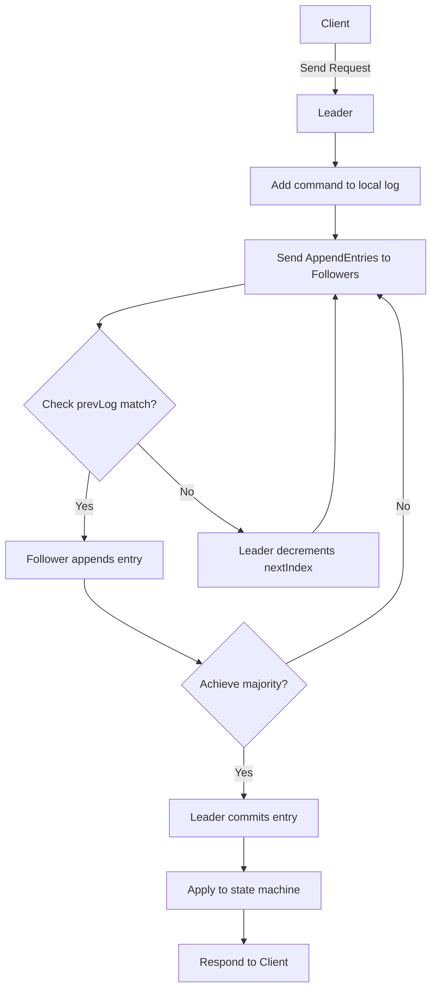

### 1. 一致性算法

>一致性算法允许一组机器像一个整体一样工作，即使其中一些机器出现故障也能够继续工作下去。Raft 是一种用来管理复制日志的算法。

**复制状态机通常都是基于复制日志实现的，如下图所示。每一个服务器存储一个包含一系列指令的日志，并且按照日志的顺序进行执行。每一个日志都按照相同的顺序包含相同的指令，所以每一个服务器都执行相同的指令序列。因为每个状态机都是确定的，每一次执行操作都产生相同的状态和同样的序列。** <br>
**一致性算法的任务是保证复制日志的一致性**


Raft 通过选举一个杰出的领导人，然后给予他全部的管理复制日志的责任来实现一致性。领导人从客户端接收日志条目（log entries），把日志条目复制到其他服务器上，并告诉其他的服务器什么时候可以安全地将日志条目应用到他们的状态机中。拥有一个领导人大大简化了对复制日志的管理。例如，领导人可以决定新的日志条目需要放在日志中的什么位置而不需要和其他服务器商议，并且数据都从领导人流向其他服务器。一个领导人可能会发生故障，或者和其他服务器失去连接，在这种情况下一个新的领导人会被选举出来。

通过领导人的方式，Raft 将一致性问题分解成了三个相对独立的子问题，这些问题会在接下来的子章节中进行讨论：

**领导选举：** 当现存的领导人发生故障的时候, 一个新的领导人需要被选举出来<br>
**日志复制：** 领导人必须从客户端接收日志条目（log entries）然后复制到集群中的其他节点，并强制要求其他节点的日志和自己保持一致。<br>
**安全性：** 在 Raft 中安全性的关键是保证状态机安全：如果有任何的服务器节点已经应用了一个确定的日志条目到它的状态机中，那么其他服务器节点不能在同一个日志索引位置应用一个不同的指令。<br>

### 2. 实现介绍
Raft 算法的实现分为三个部分：<br>
1. 选举：Raft 使用一种选举算法来选举领导人。Raft 使用一种多数投票的方式来选举领导人，即超过半数的节点同意他的任期。<br>
2. 日志复制：Raft 使用消息传递的方式来同步复制日志。<br>
3. 安全性：Raft 通过确保日志的一致性来实现安全性。<br>

#### 2.1 选举
 0. 选举过程： <br>
> 初始所有节点均为 Follower，启动随机选举定时器，成为候选者，广播投票；
 - 等待响应
  - 收到大多数（majority）节点的同意票 → 成为 Leader。
  - 收到更高任期的消息 → 自动转为 Follower。
  - 超时未获多数票 → 重新开始新一轮选举（增加 term 再试）

 ```mermaid
 graph TD
    A[Follower] -->|Election Timeout| B[Candidate]
    B --> C{"Increment Term votedFor = self"}
    C --> D[Send RequestVote to all others]
    D --> E{Received votes from majority?}
    E -->|Yes| F[Become Leader]
    F --> G[Send Heartbeats]
    G -->|AppendEntries| A
    E -->|No| H{Received AppendEntries with higher term?}
    H -->|Yes| I[Become Follower]
    H -->|No| J{Timeout again?}
    J -->|Yes| C
    I --> A
 ```
 **1. 选举策略：多数投票**<br>
 Q = N/2 + 1 <br>

**2. 服务器配置：** <br>
 
|角色 | 描述 |
| --- | --- |
| Follower（追随者）|初始状态；被动接收日志条目和心跳消息；若超时未收到 Leader 消息，则转变为 Candidate 并发起选举|
|Candidate（候选人）| 在选举过程中产生；向其他节点请求投票以成为 Leader|
|Leader（领导者）| 负责处理所有客户端请求、复制日志到其他节点，并定期发送心跳维持权威|

**2.1 通信参数和定义**

2.1.1. RequestVote RPC（请求投票）
由 Candidate 发起，用于争取选票。
|字段名|类型|说明|
| --- | --- | --- |
|term|int|候选人的当前任期|
|candidateId|string|请求投票的候选者 ID|
|lastLogIndex|int|候选人最后一条日志的索引|
|lastLogTerm|int|候选人最后一条日志的任期|

`返回值：`
|字段名|类型|说明|
| --- | --- | --- |
|term|int|当前任期|
|voteGranted|bool|是否授予选票|

✅ 投票条件（安全性规则）：
若 Follower 的 currentTerm < candidate.term，拒绝投票。
若 Follower 已在当前任期投过票，则不再投票。
若候选者的日志至少与自己的日志一样新（通过比较 (lastLogTerm, lastLogIndex)），才允许投票。

2.1.2. AppendEntries RPC（追加日志）
由 Leader 发起，用于复制日志。
|字段名|类型|说明|
| --- | --- | --- |
|term|int|领导人的当前任期|
|leaderId|string|领导人的 ID|
|prevLogIndex|int|新的日志条目的索引值|
|prevLogTerm|int|新的日志条目的任期|
|entries[]|[]Entry|日志条目(空表示心跳)|
|leaderCommit|int|领导人已提交的日志索引值|

`返回值：`
|字段名|类型|说明|
| --- | --- | --- |
|term|int|当前任期|
|success|bool|是否成功|

#### 2.2 日志复制
1. 日志结构：

|字段|类型|含义|
| --- | --- | --- |
|term|int|任期编号|
|index|int|日志索引位置|
|command|interface{}|客户端请求的操作指令（例如 "set x=5"）|

`关键原则：`
- 日志按 顺序写入，不可修改已提交条目。
- 不同节点之间的日志可能暂时不一致，但最终通过 Leader 强制同步。
- 只有当前 Leader 的日志条目可以被“提交”（committed）。

2. 日志复制流程：
> 客户端发送请求到leader，leader将请求追加到本地日志` log[lastLogIndex+1] = { term: currentTerm, command: cmd } `，并广播发送 AppendEntries RPC，要求其他节点复制日志。


<br>

`AppendEntries 请求`
|参数名|值说明|
| --- | --- |
|term|当前任期|
|leaderId|Leader 节点 ID|
|prevLogIndex|新条目前一个条目的索引（即 lastIndex）|
|prevLogTerm|prevLogIndex 对应的日志任期|
|entries[]|待复制的一组日志条目（通常一次一条）|
|leaderCommit|当前 Leader 的 commitIndex|

**Follower 按如下规则处理请求：** <br>
检查任期：若 term < currentTerm → 拒绝，返回 term。<br>
查找 prevLog 匹配：<br>
- 若本地日志中不存在 prevLogIndex 条目 → 拒绝。
- 若存在但 log[prevLogIndex].term ≠ prevLogTerm → 删除冲突条目及其后续所有条目。
追加新条目：将 entries[] 中的日志追加到本地日志。<br>
更新 commitIndex：如果 leaderCommit > commitIndex 且存在对应日志，则更新: `commitIndex = min(leaderCommit, lastIndex in log)`
返回 success = true。<br>

> 满足大多数条件后，leader 提交entry，并将其应用到状态机，然后响应客户端。

3. 日志冲突：当 Follower 日志与 Leader 不一致时 <br>
Raft 使用 强制覆盖策略 解决：
- Leader 维护每个 Follower 的 nextIndex[i]（下一次要发送的日志索引）。
- 初始值：nextIndex[i] = leader.lastIndex + 1
- 若某次 AppendEntries 失败（Follower 返回 false）：
  - Leader 将 nextIndex[i]--，重新尝试发送更早的日志。
- 直到找到第一个匹配的 (prevLogIndex, prevLogTerm)，然后从该点开始覆盖后续所有日志。
🧩 特性：Log Matching Property 如果两个日志在相同索引处有相同的任期号，则它们在此索引之前的所有条目都完全相同。

#### 2.3 安全性
> 安全性指的是任何情况下，系统不会做出错误决策。

1. 选举安全性：投票仲裁 + 单次投票原则 <br>

- 每个 Follower 在一个任期内只能投一次票；
- 使用 votedFor 字段记录已投票的候选者 ID；
- 投票请求必须满足日志新鲜度条件；

|候选者日志|自己日志|是否投票
| --- | --- | --- |
| ((term=3, idx=5)|(term=2, idx=6)|✅ 是（更高 term）
|(term=2, idx=4)|(term=2, idx=6)|❌ 否（同 term 但更短）
|(term=2, idx=6)|(term=2, idx=6)|✅ 是（相等）

2. 状态机安全性 <br>
✅ Raft 规则：只能提交当前任期的日志，且提交需多数确认 (majority) 。<br>
提交条件严格限制：
 - 一个日志条目只有在其 Leader 任期内获得了多数节点的复制，才可以被提交。
特别注意：
 - 不能仅因为老日志出现在多数节点上就提交它！
 - 必须通过当前 Leader 的新日志来“间接提交”老日志。

3. 成员变更安全性：避免脑裂  <br>
✅ Raft 解决方案：两阶段成员变更（Joint Consensus）<br>
使用联合共识（Joint Consensus）过渡：
阶段 1：进入联合状态
 - C_old,new = {A,B,C} ∪ {C,D,E}
 - → 任何操作必须同时获得 {A,B,C} 和 {C,D,E} 的多数批准
阶段 2：退出联合状态
 - 完成同步后，切换为 C_new = {C,D,E}
⚖️ 优点：任何时候都需要跨越新旧配置的交集，防止分裂。

4. 读操作安全性：ReadIndex 读（推荐） & Lease-based Read（高性能）<br>

方法 1：ReadIndex 读（推荐）
- Leader 记录当前 commitIndex；
- 向多数节点确认自己仍是 Leader（无心跳冲突）；
- 等待本地 lastApplied ≥ commitIndex；
- 执行本地读取。
✅ 保证读到最新的已提交数据。

方法 2：Lease-based Read（高性能）
- Leader 获取一个租约（如 10ms），在此期间认为自己是唯一合法领导者；
- 租约内直接本地读取，无需通信。
- ⚠️ 依赖时钟同步，适合低延迟场景。


**参考链接**：
- [Raft 论文 pdf](https://ramcloud.atlassian.net/wiki/download/attachments/6586375/raft.pdf)
- [Raft 论文中文版](https://github.com/maemual/raft-zh_cn/blob/master/raft-zh_cn.md)
- [Raft-java-demo](https://gitee.com/colins0902/raft-java-demo)
- [深度解析Raft](https://juejin.cn/post/6907151199141625870#heading-1)
- [基于硬盘的 RAFT 状态机实现方法与挑战](https://aijishu.com/a/1060000000494501)
- [Implementing Raft](https://eli.thegreenplace.net/2020/implementing-raft-part-0-introduction/)
- [实战从零开始实现 Raft｜得物技术](https://xie.infoq.cn/article/7e0d7c2c5bdd8c8ba150194b3)