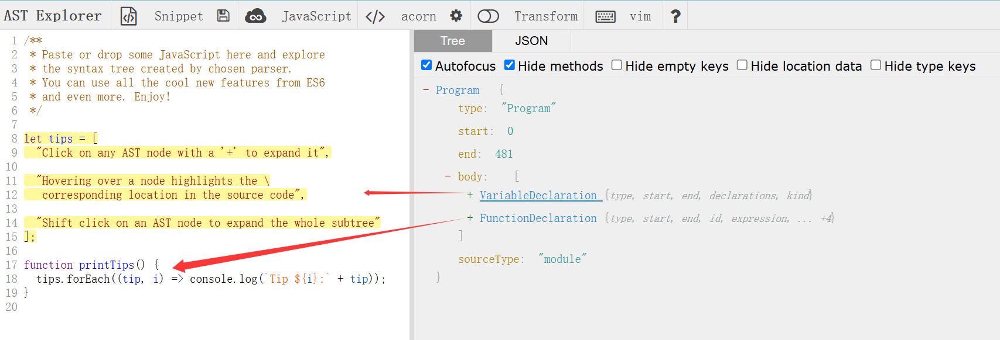

### 0. 介绍

> 我希望了解编程语言的真正执行过程，最好的办法就是自己写一种语言，但是不需要关注太多功能内容，只实现简单的脚本语言，甚至不完全实现加减乘除的功能。不仅仅是面向对象的语言，SQL和Shell此类脚本语言同样适用。

参考链接：

* [Java 实现](https://hackernoon.com/building-your-own-programming-language-from-scratch#aboutCard)👍使用Java语言实现自己的编程语言，Github仓库内容更加完备，有着额外相关的包管理和堆栈上下文操作实现
* [JavaScript 实现](https://medium.com/@abiliu018/how-i-created-my-own-programming-language-from-scratch-9b99fa0a802b)👍使用JS实现，可以和Java的对照理解，加深对各组件实现的理解。
* [AST](https://astexplorer.net/)👍 可以直观看到每种语言的源码会被解析成什么样的结果，建议了解，比较直观的AST结构



### 1. 高级语言的解析

1. **Lexical analysis**(词法分析)：用于将源码内容进行标记，例如以Java和JS为例，`new` 、`let` 作为关键字（KeyWord），空格换行（`\t \n`）作为空字符，操作符（`+` `-` `*` `/` `!`）等。。。
2. **Syntax analysis or parser**（语法分析器）：用于将词法分析后的标记解析生成AST（抽象语法树）；
3. Evaluator：负责解析和执行你的源代码，通过遍历分析器生成的AST实现。

### 2. 最终成果

> 下面会给出关键代码（非具体），完成的过于简单，仅供参考。
>
> 也可参考Mybatis的org.apache.ibatis.ognl下AST操作

[代码 demo](https://github.com/sansWl/OScrLan)

```java
 @SneakyThrows
    public void execute(Path path) {
        String source = Files.readString(path); //读取源码文件
        LanguageParser lexicalParser = new LanguageParser<>(new ArrayList<>(),source);//解析源码
        List<Token> tokens = lexicalParser.parse();
        StatementParser statementParser = new StatementParser(tokens); //词性分析
        Statement statement = statementParser.parse();
        statement.execute(); //执行
    }
```

```txt
struct Person
    arg name
    arg experience
    arg developer
end

input your_name
input your_experience_in_years
input is_developer

person = new Person [your_name your_experience_in_years is_developer]
print person :: name

if person :: developer then

    person_name = person :: name
    print "hey " + person_name + "!"

    experience = person :: experience

    if experience > 0 then
        started_in = 2022 + experience
        print "you had started your career in " + started_in
    end

end
```

#### 2.1 Token

> 词元标记，直白说就是对每个字符进行分类存储，比如说 { a,b,v,c,d,e... }这些可以标记为英文字符,{我，你，她......}标记为中文字符，而当我们学习高级语言或其他编程语言时，我们总会先学习例如关键字（`new`、`if` 、`while`.....）这些就可以标记为关键字，同理（`>` 、`<`、`*` 、`/`、`=` ....）可以标记为操作符,完成赋值、运算等功能。

```java
/**
以下标记分类作为参考，可在上述链接的github找到更加全面的分类
*/
public enum TokenType {
            Whitespace("[\\s\\t\\n\\r]"),
            Keyword("(if|then|end|print|input|struct|arg|new)"),
            LogicalOperator("true|false"),
            Numeric("[0-9]+"),
            GroupDivider("(\\[|\\])"),
            Text("\"([^\"]*)\""),//双引号包裹的标记字符串
            Variable("[a-zA-Z_]+[a-zA-Z0-9_]*"), //标记为变量
            Operator("(\\+|\\-|\\>|\\<|\\={1,2}|\\!|\\:{2})"),//标记为操作符
            Comment(""),
            EndOfFile("");
}
/**
存储解析的词元性质，record 是JDK14+ 特性
*/
public record Token(TokenType nameType, String value) {}

```

#### 2.2 lexicalParser

> 简单来说，就是将你设定的源码文件内容字符读取进行标记分类好并存储起来，比如person **=** **new** Person [ arg1 arg2 ]  一行中`person`标记为变量，`=`标记为操作符，` new`标记为关键字等等，标记的具体含义是自定义的。

```java
  public int nextToken(int position) {
        String nextToken = source.substring(position);
        /*对源文件的词元进行分类存储到 this.tokens集合中，
        集合推荐使用LinkedList一类的，保证词元解析顺序，
        尤其是结构体这块需要注意，变量和对象参数的对应顺序问题 */
        return TokensReslove.resolve(nextToken, (List<Token>) this.tokens);
    }

// 解析分类Token
    public List<Token> parse() {
        int position = 0;
        while (position < source.length()){
            position+=nextToken(position);
        }
        return (List<Token>) tokens;
    }
```

#### 2.3 statementParser

> 利用解析获得Token（即分类好的单词【空格、person、= 、+、。。。。】）组成AST，最后遍历执行

```java
// 构建AST和执行语句
public Statement parseExpression() {
         Token token = nextToken(TokenType.Keyword,TokenType.Variable);
         switch (token.nameType()){
             case Keyword:
                 switch (token.value()){
                     case "if":
                         Expression condition = readExpression();
                         nextToken(TokenType.Keyword, "then"); //skip then

                         ConditionStatement conditionStatement = new ConditionStatement(condition);
                         while (!peek(TokenType.Keyword, "end")) {
                             Statement statement = parseExpression();
                             conditionStatement.add(statement);
                         }
                         nextToken(TokenType.Keyword, "end"); //skip end

                         return conditionStatement;
                     case "print":
                         Expression expression = readExpression();
                         return new PrintStatement(expression);
                     case "input":
                         Token var = nextToken(new TokenType[]{TokenType.Variable});
                         return new InputStatement(var.value(), scanner::nextLine,variables::put);
                     case "struct":
                         Token type = nextToken(new TokenType[]{TokenType.Variable});

                         Set<String> args = new LinkedHashSet<>();
                         while (!peek(TokenType.Keyword, "end")) {
                             nextToken(TokenType.Keyword, "arg");

                             Token arg = nextToken(new TokenType[]{TokenType.Variable});
                             args.add(arg.value());
                         }
                         nextToken(TokenType.Keyword, "end"); //skip end

                         structures.put(type.value(), new StructureDefinition(type.value(), new LinkedList<>(args)));

                         return null;
                 }
             case Variable:
                 nextToken(TokenType.Operator, "=");
                 Expression expression;
                 if (peek(TokenType.Keyword, "new")) {
                     expression = readInstance();
//                     expression = null;
                 } else {
                     expression = readExpression();
                 }
                 return new AssignStatement(token.value(), expression, variables::put);
             case Text:
             default:
                 throw new IllegalArgumentException("Expected keyword or variable but found " + token.nameType() + " " + token.value());
         }

    }

  //解析token组成AST
    public Statement parse() {
        CompositeStatement root = new CompositeStatement();
        while (position < tokens.size()) {
            Statement statement = parseExpression();
            root.add(statement);
        }
    // root下包含着需要执行的操作语句，比如构建对象，if判断，输入，输出等语句
        return root;
    }

    @Override
    public void execute() {
       // root  执行语句
        for (Statement statement : statements) {
            statement.execute();
        }
    }

```

#### 2.4 问题

* 变量和对象参数顺序问题：

```txt
  struct Person
      arg name
      arg experience
      arg developer
  end
  input your_name
  input your_experience_in_years
  input is_developer
  //name、experience、developer被赋值需要和变量顺序一致，但是如果你使用hashmap存储参数会导致顺序为name、developer、experience
  person = new Person [your_name your_experience_in_years is_developer]
```

* 如何打包成可执行文件？要求 JDK 14 +
  [Java打包工具jpackage - 官方文档](https://docs.oracle.com/en/java/javase/21/jpackage/preface.html#GUID-C8F52DC6-0750-497D-9DAB-2F88E10787BE)
  [Jpackage-制作无需预装Java环境的Jar可执行程序](https://segmentfault.com/a/1190000044693072)

### 3. 扩展（可增强学习点）

* 内存上下文：栈、堆、静态变量、常量池、方法区等
* 包管理：类似Java的包管理机制，包括包的导入、导包、类的加载、类的冲突解决等。
* 异常处理：try-catch-finally
* 多线程：线程创建、同步、锁、死锁、线程池（线程的本质就是创造一个关于操作符的堆栈）
* GC：垃圾回收算法、垃圾回收器、内存分配策略、内存碎片、内存泄漏
* 语法糖：语法糖是指一些语法的扩展，比如Java中的Stream API、Lambdas表达式、Optional类等。
